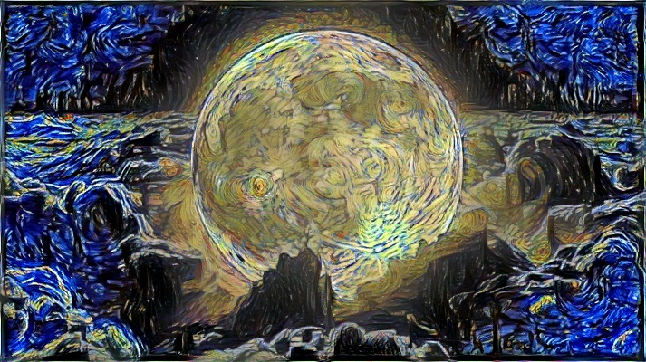

# Neural Style Transfer

This project implements the classic "A Neural Algorithm of Artistic Style" by Gatys et al..
The goal is to blend the content of one image with the style of another using optimization and deep neural network features.

## How It Works (Brief)

A pretrained CNN (typically VGG19) extracts feature representations from both the content and style images.

Content loss ensures the generated image maintains the structural layout of the content image.

Style loss uses Gram matrices to match textures, colors, and patterns from the style image.

The model iteratively updates a generated image to minimize both losses and produce a stylized result.

## Example
Content Image: 

Style Image: 

Stylized Output: 

