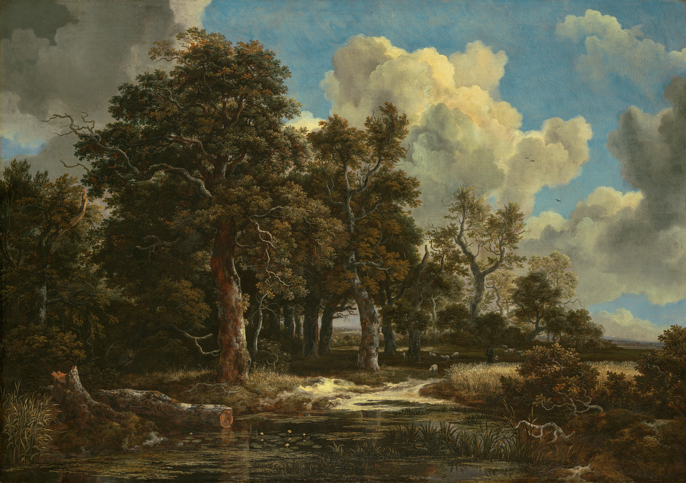
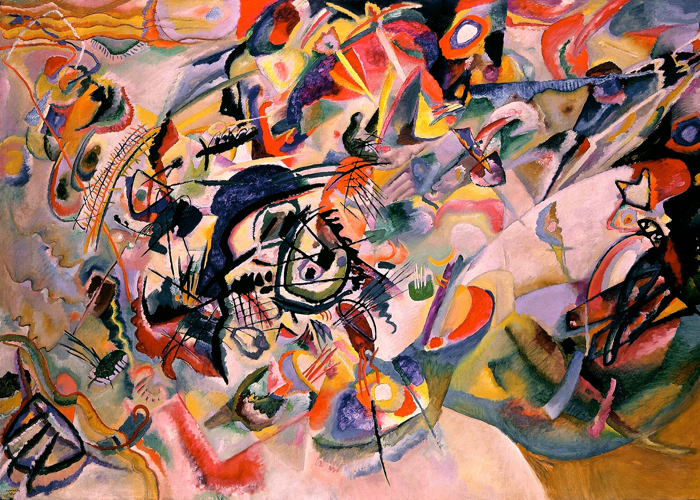
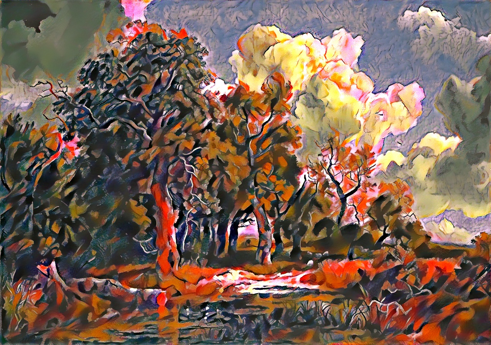

# Neural Style Transfer

This project implements the classic "A Neural Algorithm of Artistic Style" by Gatys et al..
The goal is to blend the content of one image with the style of another using optimization and deep neural network features.

## How It Works (Brief)

A pretrained CNN (typically VGG19) extracts feature representations from both the content and style images.

Content loss ensures the generated image maintains the structural layout of the content image.

Style loss uses Gram matrices to match textures, colors, and patterns from the style image.

The model iteratively updates a generated image to minimize both losses and produce a stylized result.

## Example
Content Image: 


Style Image: 


Stylized Output: 


## How to Run

### Prerequisites

Install the required dependencies:
```bash
pip install torch torchvision pillow
```

> A CUDA-compatible GPU is recommended for faster processing.

### Usage
```bash
python main.py <content_image> <style_image> <output_dir> <image_size>
```

**Arguments:**

| Argument | Description | Example |
|---|---|---|
| `content_image` | Path to the content image | `images/photo.jpg` |
| `style_image` | Path to the style/reference image | `images/style.jpg` |
| `output_dir` | Directory to save output images | `outputs/` |
| `image_size` | Resize the longer edge to this value (px) | `512` |

### Example
```bash
python main.py images/photo.jpg images/starry_night.jpg outputs/ 512
```

Output images are saved to the specified directory after each epoch, named `0.jpg`, `1.jpg`, ..., `39.jpg`.
